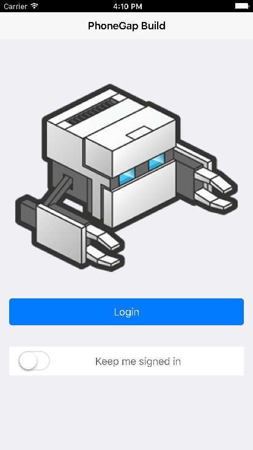
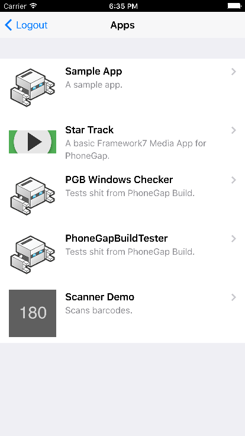
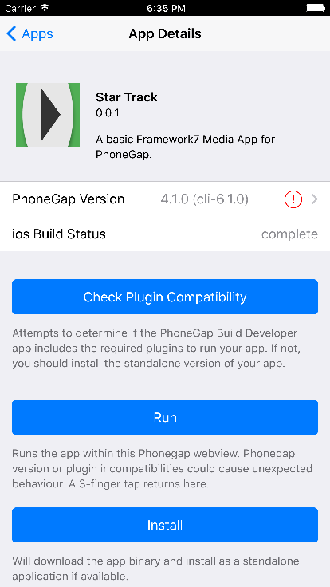

# PhoneGap Build Developer App

Log into PhoneGap Build, view and run your PGB apps within the same webview, or optionally install them individually.

## Building on PhoneGap Build

Unfortunately, not at the moment (you can build it on build, but you can't yet inject plugin params into code files with plugman).

## Building Locally

To build this yourself, clone the repo and initialize with npm:

    git clone http://github.com/phonegap/phonegap-app-pgb.git
    npm install

Obtain API oauth client credentials (a `CLIENT_ID` and `CLIENT_SECRET`) from [PhoneGap Build](https://build.phonegap.com/people/edit). Add the credentials to the PGB Oauth Plugin for [Android](blob/master/platforms/android/src/com/phonegap/build/oauth/PhonegapBuildOauth.java#L25) and [iOS](blob/master/platforms/ios/PhoneGap%20Build/Plugins/com.phonegap.build.oauth/CDVPhonegapBuildOauth.m#L13)

    npm install -g phonegap@6.0.3
    git clone https://github.com/wildabeast/phonegap-app-pgb.git

## Compile and Run

    phonegap run ios
    phonegap run android

## Screenshots

    
